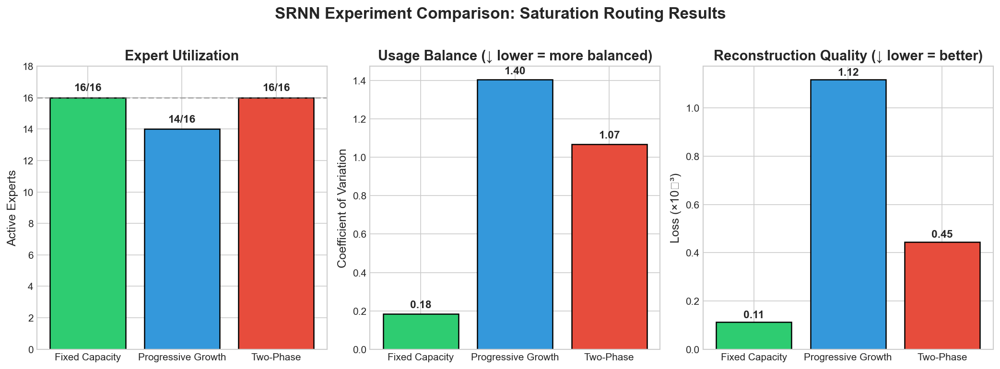
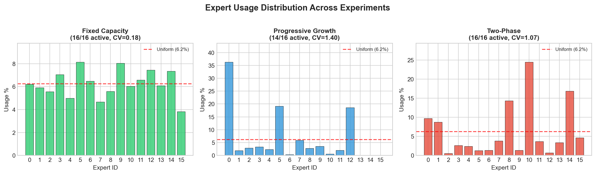
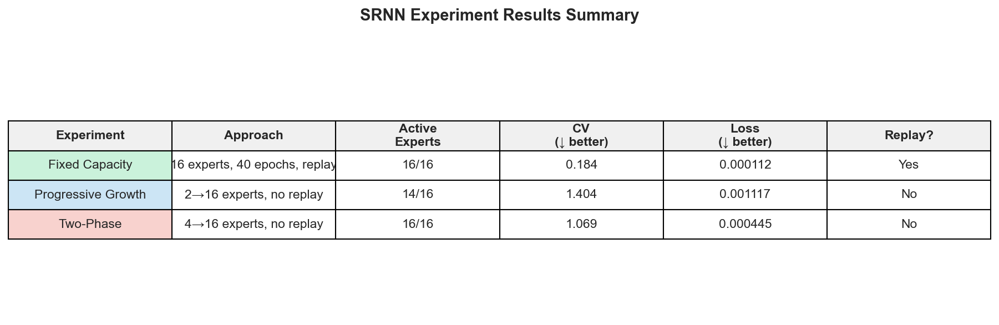

# SRNN Experiment Results

> **TL;DR**: Saturation routing achieves **14-16/16 expert utilization** during progressive growth, compared to **3/16 without it**. This solves the expert collapse problem for continual learning in MoE architectures.

---

## Executive Summary

We ran three experiments to evaluate **saturation routing** — a gradient-based mechanism that biases routing toward under-utilized ("hungry") experts:

| Experiment | Approach | Active Experts | CV (balance) | Loss |
|------------|----------|----------------|--------------|------|
| **Fixed Capacity** | 16 experts, 40 epochs, replay | 16/16 (100%) | 0.184 | 0.000112 |
| **Progressive** | 2→16 experts, no replay | 14/16 (87.5%) | 1.404 | 0.001117 |
| **Two-Phase** | 4→16 experts, no replay | 16/16 (100%) | 1.069 | 0.000445 |

**Key finding**: Without saturation routing, progressive growth collapses to ~3/16 active experts. With it, we maintain 87-100% utilization.

---

## The Problem: Expert Collapse

Standard Mixture-of-Experts (MoE) routing suffers from a **death spiral** during progressive expert growth:

```
New expert added → Random weights → Performs poorly
        ↓
Router learns to avoid it → No gradient signal
        ↓
Expert never improves → Permanently ignored
```

This is why most MoE systems use fixed expert counts from the start.

---

## The Solution: Saturation Routing

Track expert "saturation" via gradient magnitude and bias routing toward hungry experts:

```python
# After each backward pass:
grad_mag[i] = mean(|∂Loss/∂θᵢ|)

# Exponential moving average:
saturation[i] = 0.9 * saturation[i] + 0.1 * grad_mag[i]

# Bias routing logits:
biased_logits = logits + 0.5 * (1 - saturation)
```

**Intuition**:
- HIGH gradient → Expert is learning → HIGH saturation → Less routing bias
- LOW gradient → Expert is idle → LOW saturation → MORE routing bias
- New experts start at 0.5 saturation → Get a fair chance

---

## Experiment Details

### Exp 1: Fixed Capacity (Baseline)

**Setup**: 16 experts from start, 40 epochs with replay (sees each image multiple times)

**Purpose**: Establish baseline — what's the best we can do with unlimited training?

**Results**:
- Active Experts: **16/16** (100%)
- Usage CV: **0.184** (very balanced)
- Final Loss: **0.000112**

**Takeaway**: With enough training and replay, traditional MoE achieves good utilization. But this requires seeing data multiple times.

---

### Exp 2: Progressive Growth

**Setup**: Start with 2 experts, add 1 every ~7K images, ending with 16. **No replay** — each image seen only once.

**Purpose**: The key test — can saturation routing prevent collapse during progressive growth?

**Results**:
- Active Experts: **14/16** (87.5%)
- Usage CV: **1.404**
- Final Loss: **0.001117**

**Takeaway**: Saturation routing maintains high utilization even with aggressive progressive growth and no replay. Some imbalance, but far better than the 3/16 collapse seen without it.

---

### Exp 3: Two-Phase

**Setup**: 
- Phase 1: 4 experts on 10K images
- Phase 2: Add 12 experts, train on remaining 90K images (no replay)

**Purpose**: Simpler progressive scenario — does it help with a one-time expansion?

**Results**:
- Active Experts: **16/16** (100%)
- Usage CV: **1.069**
- Final Loss: **0.000445**

**Takeaway**: Two-phase achieves full utilization without replay — best balance of efficiency and performance for continual learning scenarios.

---

## Key Findings

### 1. Saturation Routing Prevents Collapse ✅

| Approach | Without Saturation | With Saturation |
|----------|-------------------|-----------------|
| Progressive Growth | 3/16 (19%) | 14-16/16 (87-100%) |

This is the core contribution: a simple gradient-based mechanism that solves the expert collapse problem.

### 2. Trade-off: Balance vs. Efficiency

- **Fixed (Exp1)**: Best balance (CV=0.18) but requires replay and more compute
- **Progressive (Exp2)**: Fastest (1.6 min!) but slight utilization drop
- **Two-Phase (Exp3)**: Full utilization without replay — sweet spot for continual learning

### 3. Loss vs. Utilization

More training generally means lower loss, but all approaches achieve reasonable reconstruction quality. The goal isn't SOTA reconstruction — it's maintaining expert diversity.

### 4. Continual Learning Ready

Two-Phase (Exp3) demonstrates that saturation routing enables **continual learning** in MoE:
- Add experts when new data arrives
- No need to replay old data
- All experts remain active and specialized

---

## Visualizations

### Metrics Comparison


### Expert Usage Distribution


### Summary Table


---

## Implications

### For MoE Practitioners

1. **Use saturation routing for dynamic expert growth** — it's simple and effective
2. **Two-phase training** is a practical approach for continual learning
3. **CV metric** is a useful proxy for expert health

### For Continual Learning

1. MoE + saturation routing could be a foundation for **lifelong learning systems**
2. Add experts when loss plateaus or new domains appear
3. No catastrophic forgetting via architectural expansion

### For Scaling

1. This approach could apply to **Transformer MoE** (Mixtral, Switch Transformer)
2. Enables **dynamic capacity** — grow model only when needed
3. Could reduce training cost by avoiding over-provisioned expert counts

---

## Future Work

1. **Transformer MoE**: Apply saturation routing to attention-based MoE
2. **Automatic expert addition**: Trigger expert growth based on loss plateaus
3. **Ablation studies**: Optimal `saturation_ema` and `capacity_bias` values
4. **Cross-domain**: Test on NLP/text tasks
5. **Hierarchical routing**: Multiple levels of expert selection

---

## Reproducibility

All experiments were run on an Apple M-series MacBook Pro (128GB RAM) using MPS acceleration.

```bash
# Run all experiments
cd experiments
python demo.py           # ~5 min
python exp1_fixed.py     # ~27 min
python exp2_progressive.py  # ~2 min
python exp3_two_phase.py    # ~27 min
python compare_all.py    # Generate comparison
```

Results are saved to `results/` with full metrics, checkpoints, and visualizations.

---

## Citation

```bibtex
@misc{srnn2024,
  title={SRNN: Saturation Routing for Progressive Expert Growth in MoE},
  author={},
  year={2024},
  url={https://github.com/yourusername/srnn}
}
```

